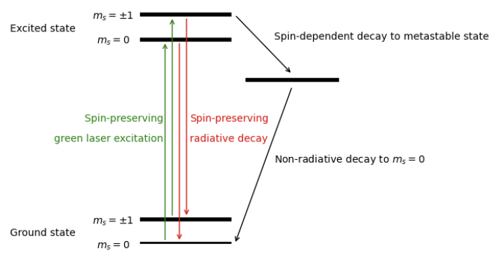

### How They Work
Nitrogen-vacancy (NV) centers are solid-state systems with the advantage of simulating quantum processes at room temperature. In essence, they are defects in diamonds: 2 carbon atoms replaced with a nitrogen atom and a vacancy (hence the name). The qubit state is the spin of the trapped nitrogen atom in the ground state — up vs. down, with superposition being the halfway point. Microwave pulses are applied as gates and, similar to trapped ions, they are only resonant with one spin state. 

### Pros
Diamonds offer a variety of benefits as qubits. Its high thermal conductivity allows for efficient heat dissipation, electrical insulation provides isolation from external noise, and hardness/durability leads to physical protection. There is also the advantage of room temperature as mentioned previously.

### Cons
Despite these many advantages, NV centers are currently still primarily in the research stage. They require extremely precise nanofabrication abilities and are difficult to control, leading to limited scalability and high error rates. Because of the limited scalability, NV centers are now being more studied for quantum sensing which require less qubits than quantum computing.

### Initialization
NV centers in the ground state is a spin triplet state with a $$m_s=0$$ sublevel and degenerate $$m_s=\pm1$$ sublevels separated by a zero field splitting of around 2.87 GHz. When shot with green laser (532 nm), the states become excited. The excited $$m_s=0$$ state relaxes down to the ground $$m_s=0$$ state. However, the $$m_s=\pm1$$ can either go relax down to the ground state $$m_s=\pm1$$ or to an intermediate, metastable singlet state through intersystem crossing. From the intermediate state, the the $$m_s=\pm1$$ relaxes down to the ground state $$m_s=0$$. Because the excited $$m_s=\pm1$$ has a higher probability undergoing intersystem crossing than the normal energy relaxation, shining the green laser for a long amount of time initializes the qubit to $\ket{0}$ with a high probability.

### Readout
Optical readout of the nitrogen-vacancy (NV) center is based on spin-dependent fluorescence under green (532 nm) excitation. When the $$m_s=0$$ state relaxes to ground state, it produces a strong fluorescence of red. When the $$m_s=\pm1$$ states relaxes through the metastable singlet state, it appears dimmer. By measuring the emitted photon counts, the spin state can be distinguished, with higher fluorescence indicating $\ket{0}$ and lower fluorescence indicating $\ket{\pm1}$. With repeated measurements, we can determine the probabilities of $\ket{0}$ and $\ket{1}$ which is the readout.

### Control
Coherent control of an NV center is achieved by driving transitions between its ground-state spin levels using resonant microwaves. The qubit is typically encoded in $\ket{0} \equiv m_s = 0,\; \ket{1} \equiv m_s = -1$, which are split by the zero-field splitting and can be tuned with a magnetic field. When a microwave field is applied at the transition frequency, it induces coherent rotations between the two states. This results in Rabi oscillations, where the spin cycles between $\ket{0}$ and $\ket{1}$. By controlling the pulse duration and phase, arbitrary single-qubit rotations and superposition states can be created. This unitary control is essential for using NV centers in quantum sensing and quantum information applications.